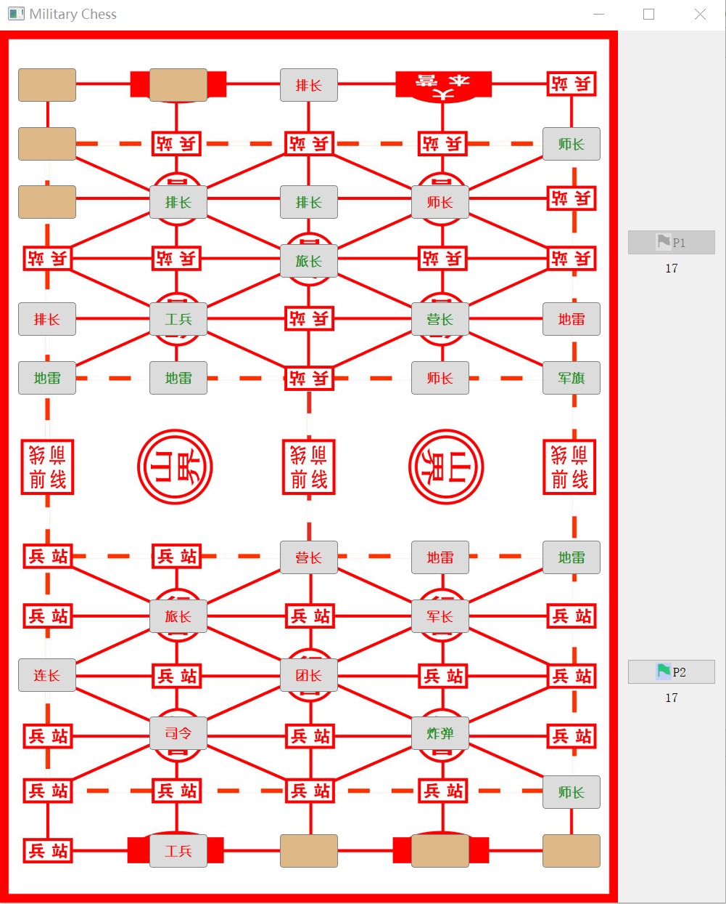

[](https://github.com/lh9171338/Outline) Military Chess
===

# 1. Introduction
>>This repository is a military chess game implemented by PyQt5.

# 2. Run
```shell
python MilitaryChess.py
```

# 3. UI
<p align="center">
    
</p> 
